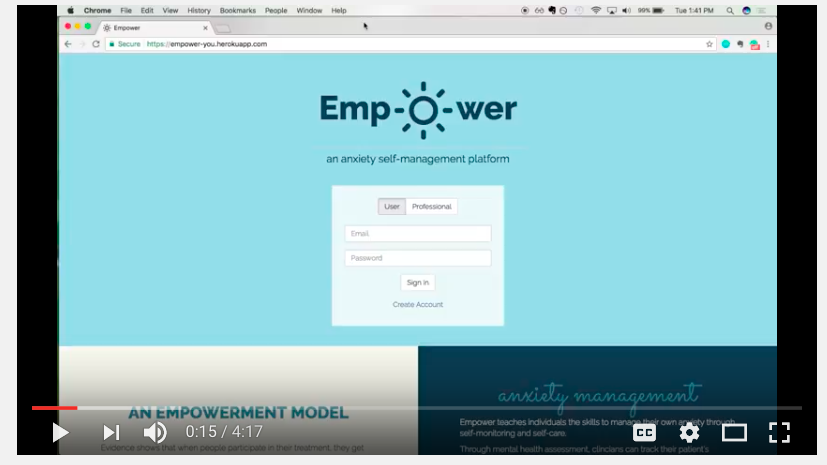

# EMPOWER
#### an anxiety self-management platform
##

This is the repo for the React front-end. Feel free to check out the repo for our [Rails API](https://github.com/jenniferwiner/empower-api) on Github.

Check out the video walk through of Empower!

Tech Stack:
- JavaScript / React
- Ruby on Rails
- PostgreSQL

More informtion coming soon!

Special thanks to Margaret Lazar, Network Director of Allied Health
& Integrated Care Services (St Vincent's Hospital Sydney, NSW).

&copy; Empower, 2017 - Jennifer Winer & Emily Ringoen
